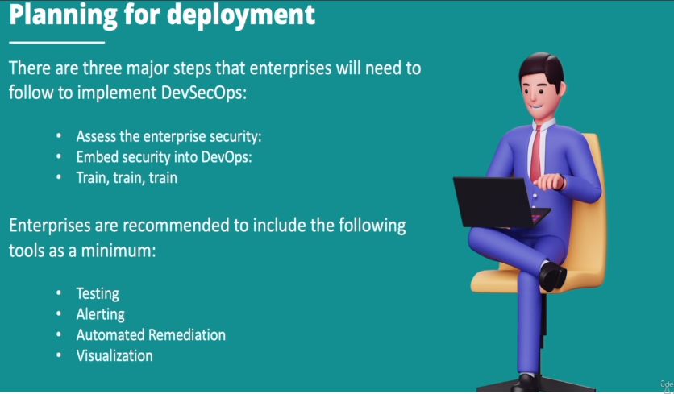
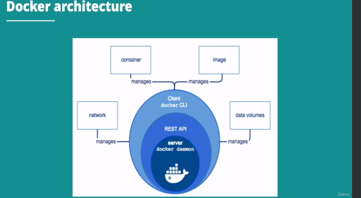
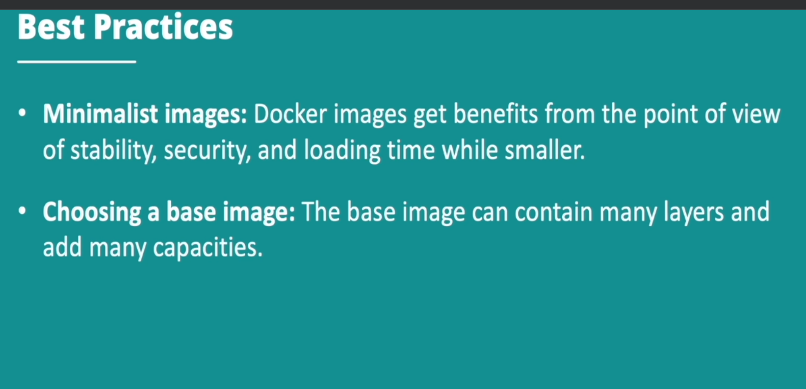

## devsecops 

* install docker

* apt-get install audit.rules

*  cd /etc/audit/rules.d/

* vim audit.rules
 ```
    # set failure mode to syslog

    -f l
    -w /usr/bin/docker -k docker
    -w /var/lib/docker -k docker
    -w /etc/docker -k docker
    -w /etc/default/docker -k docker
    -w /usr/lib/systemd/system/docker.server -k docker
    -w /etc/default/docker -containerd -k docker
    -w /usr/bin/docker.runc -k docker

```
* sudo service audit restart

* cd /var/log/audit

* more audit.log

## devSecOps 

* development and operatin teams

    * based on business demand

    * based on business plan

    * develop

    * operations

    * deployment





### Docker

* docker have multiple containrs share the same core but each container can be restriced to usin resource cpu , memory and input , output resources

* minimum system files for it'sselves to work , it doesnot need multiple versions of the same operating system 

* containers are self managed


### docker orchistration



* docker CLI (client) server communicates on server(docker deamon) using rest API .

* dockerfiles run in the root user because of different users with different previleges .


* deamonless: 

It does not need to raise a single deamon of many services to work .

Similar to the micro-container Orchetecture & excecutes neccessary services for each containers .

* pods : pod is a small deployment unit of computing create a image . after usally a group of one or more containers which gets storage & network resources .

* podman manages the entaire container cho sysem including the pods , containers , images ,volumes . This are used in the libpod library .

* sudo apt-get update

* sudo apt-get install podman -y

* podman --help

* podman ps 

* podman images

* podman pull httpd

* podman inspect <imagename/image id>

* podman search python 


* docker compose : several containers are run by using one single command .

* docker save <imagename> -o <file.tar>

* docker save <image> > backup-ubuntu.tar

##### detach:

* docker etach mode means allow to thin gate the differance in background of deamon process 

##### deamon

* execute the container in the backround mode .

* docker run -i -t --detach --name python python:latest /bin/bash


* you want to know the packages & libraries inside the container 

    * dpkg -i 


##### differance between podman & docker 

While both Podman and Docker allow users to run, manage, and deploy containers in an efficient and scalable manner, there are some key differences between the two. In this section, we will explore several of these differences:

1. Architecture differences
One of the main differences between Podman and Docker lies in their architecture. While Docker relies on a client-server model, Podman employs a daemonless architecture. With Podman's approach, users manage containers directly, eliminating the need for a continuous daemon process in the background. 

[link-referance-about pod man](https://betterstack.com/community/guides/scaling-docker/podman-vs-docker/#podman-vs-docker-comparison)

* deamonless: podman

* system integration: podman

* group containers in pods:  podman

* support docker swarm:  docker

* support k8s yaml: podman

### k8s





